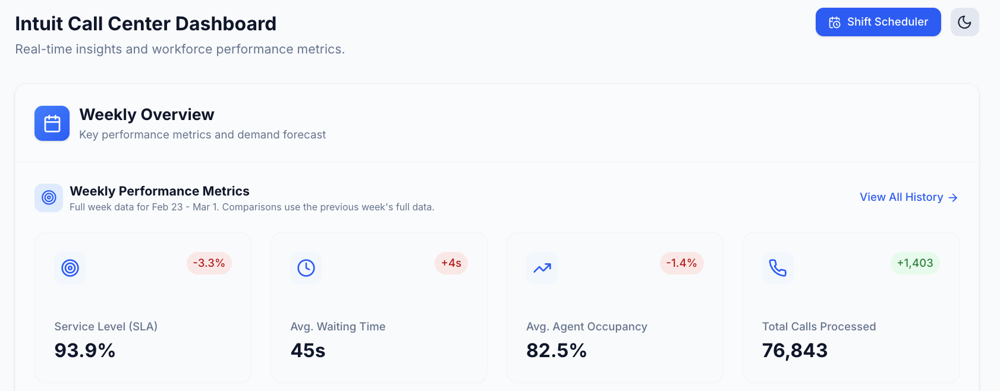
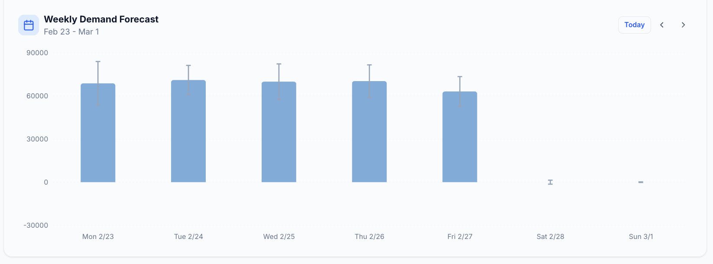
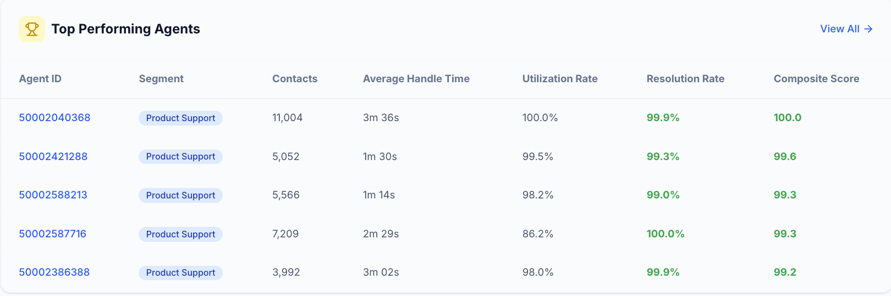
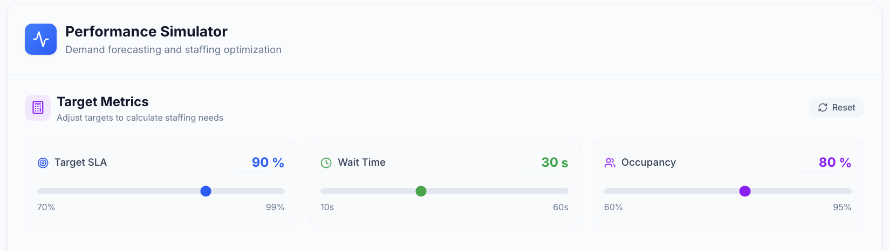
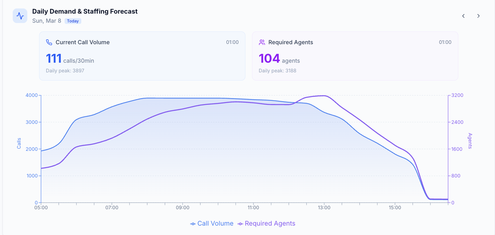
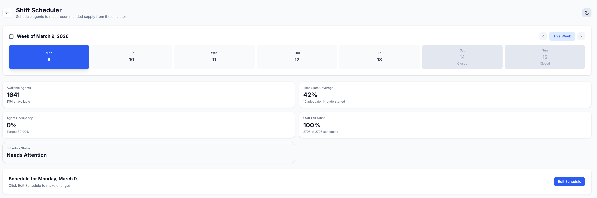
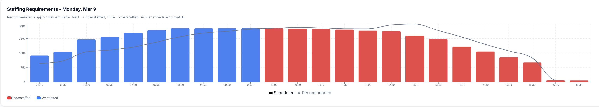
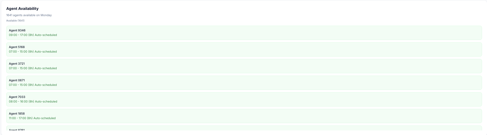

# Results & Reporting

_This page captures the modeling outcomes, workforce optimization feasibility, and the final dashboard deployment used to translate these forecasts into operational staffing decisions._

## Executive Summary

- **Forecasting Excellence**: The Short-Term forecasting model (< 7 Days) achieved highly accurate results (WMAPE: **3.11%**), driven predominantly by immediate autoregressive signals. The Long-Term ensemble (>= 7 Days) effectively captured macro-seasonal trends with a WMAPE of **13.12%**.
- **Optimization Feasibility**: The abandonment-aware workforce optimizer successfully found feasible staffing solutions for **100%** of the tested half-hour intervals (April 14-18, 2025), keeping average wait times under 5 seconds while maintaining occupancy targets.
- **Operationalization**: An end-to-end Workforce Management Dashboard has been deployed, allowing managers to monitor SLA compliance, run performance simulations, and interactively schedule shifts based on model outputs.

## Metrics Dashboard

| Date | Model/Version | Dataset | Metric(s) | Result | Notes |
| --- | --- | --- | --- | --- | --- |
| 2025-11-15 | Short-Term LGBM (< 7 Days) | Sequential Test | WMAPE / R² | **3.11%** / **0.9979** | Driven by lag features & weekly cyclicality. |
| 2025-11-15 | Short-Term LGBM (< 7 Days) | Sequential Test | MAE / RMSE | **28.55** / **58.88** | Highly sensitive to preceding 30-min volume. |
| 2025-11-15 | Long-Term Ensemble (>= 7 Days)| Sequential Test | WMAPE / R² | **13.12%** / **0.9706** | Relies on historical averages & YoY baselines. |
| 2025-11-15 | Long-Term Ensemble (>= 7 Days)| Sequential Test | MAE / RMSE | **120.25** / **220.71**| Captures macro-seasonal/operational states. |
| 2025-04-18 | WFO Binary Search | April 14-18 Vol | Feasibility | **100%** | Found solutions for all 120 half-hour intervals. |

## Workforce Optimization Results

The optimizer was evaluated over the work week of April 14, 2025, through April 18, 2025. Under the default constraint set (SLA target = **0.80**, Wait Time limit = **60s**, Occupancy cap = **0.85**):
* **SLA Compliance**: Mean predicted compliance was **99.85%** (minimum interval-level SLA of **90.66%**).
* **Wait Times**: Mean predicted wait time was **0.07 seconds** (maximum interval-level wait time was **4.19 seconds**).
* **Agent Occupancy**: Tightly bounded between **83.47%** and **84.97%**.

**Constraint Sensitivity Analysis**
The optimizer's sensitivity to the occupancy constraint was tested by varying the occupancy cap:
* **Relaxing** the cap from 0.85 to 0.90 reduced total agent-slots required by **~5.6%**.
* **Tightening** the cap from 0.85 to 0.75 increased staffing requirements by **~13.3%**.

---

## Workforce Management Dashboard & Visualisations

Interactive dashboard components translate our forecasts and queueing models into actionable staffing decisions. 

### 1. Main Dashboard
The dashboard provides a high-level overview of operational performance, forecasted demand, and workforce activity for rapid situational awareness.

_Figure 1: Main dashboard interface showing weekly performance metrics, demand forecast, and agent productivity summary._

**Weekly Overview & Forecasts**
Dynamically calculates week-to-date SLA, average wait times, occupancy, and total calls. It displays a seven-day forecast bar chart differentiating past, current, and future days.

_Figure 2: Weekly call demand forecast visualized across the seven days of the selected week._

**Top Performing Agents**
Highlights individual productivity with real-time status, calls handled, handle time, and utilization rates.

_Figure 3: Top-performing agents table displaying real-time status and productivity metrics._

### 2. Performance Simulator
An interactive environment for evaluating staffing requirements under different operational targets, integrating demand forecasts with Erlang-based queueing calculations.

**Target Metrics Configuration**
Managers can use slider controls to adjust SLA targets, maximum waiting time thresholds, and occupancy limits to evaluate alternative strategies in real-time.

_Figure 4: Performance simulator controls allowing managers to adjust SLA, waiting time, and occupancy targets._

**Daily Demand and Staffing Forecast**
Visualizes predicted call volume (area chart) and required staffing (bar overlay) at a 30-minute granularity over a 24-hour period.

_Figure 5: Daily demand and staffing forecast visualization at 30-minute granularity._

### 3. Shift Scheduler
Translates predicted staffing requirements into operational shift assignments while respecting workforce constraints.

**Overview & Metrics**
Users select the week/day via an interactive calendar to view coverage summaries, available agents, staffed time slots, and schedule completion status.

_Figure 6: Shift scheduler overview showing week and day selection, staffing coverage summary metrics, and schedule editing controls._

**Interactive Timeline & Agent Assignment**
A 24-hour timeline allows managers to drag blocks to create shifts. Managers can drag agents directly from the availability lists onto the timeline. Schedules automatically lock once the date begins.

_Figure 7: Interactive shift scheduling timeline showing agent shifts and required staffing levels._

_Figure 8: Available and unavailable agent lists used for shift assignment._

---

## Narrative Reports & Stakeholder Communication

- **Methodology Handover**: The comprehensive modeling pipeline and queuing theory mathematics have been documented in the Methods tab. 
- **Tooling Access**: The UI is currently deployed for Call Center Shift Managers. 
- **Status Updates**: Weekly syncs are held with the Operations steering committee to review forecasting accuracy and schedule adherence.

## Next Steps & Open Questions

- **Model Drift Monitoring**: Establish automated alerts if the Short-Term model's WMAPE degrades beyond 5% for three consecutive days.
- **User Adoption**: Track manager engagement with the Performance Simulator to ensure the binary search outputs are trusted over legacy heuristic scheduling.
- **Feature Expansion**: Investigate incorporating real-time shrinkage (unplanned absences) into the immediate intraday autoregressive forecast.